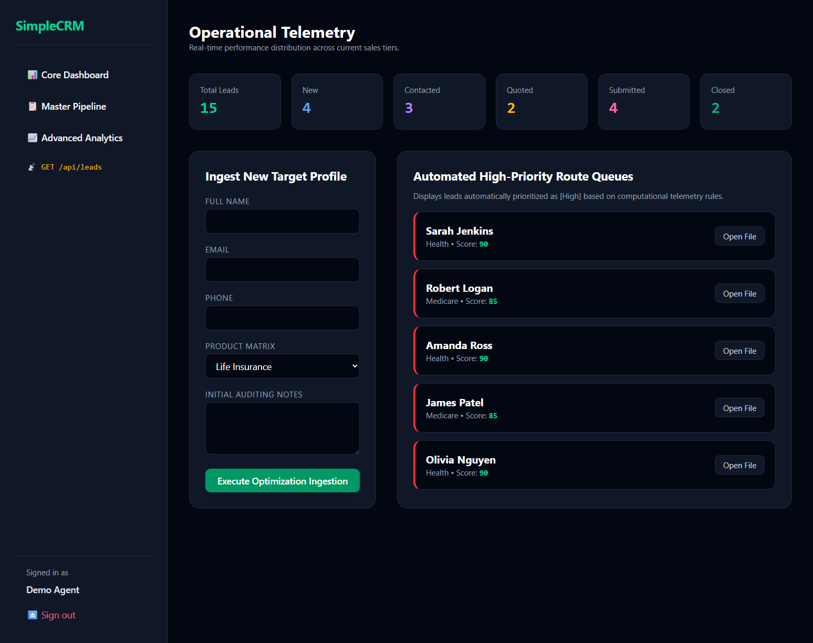
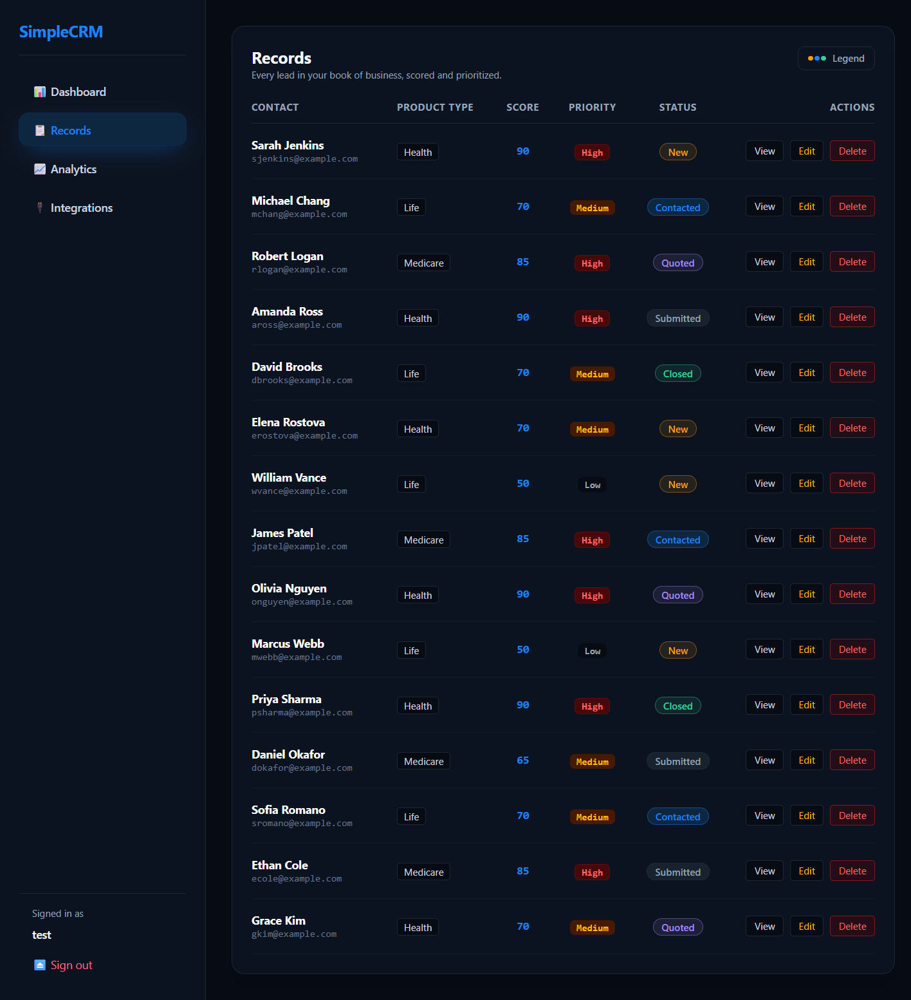
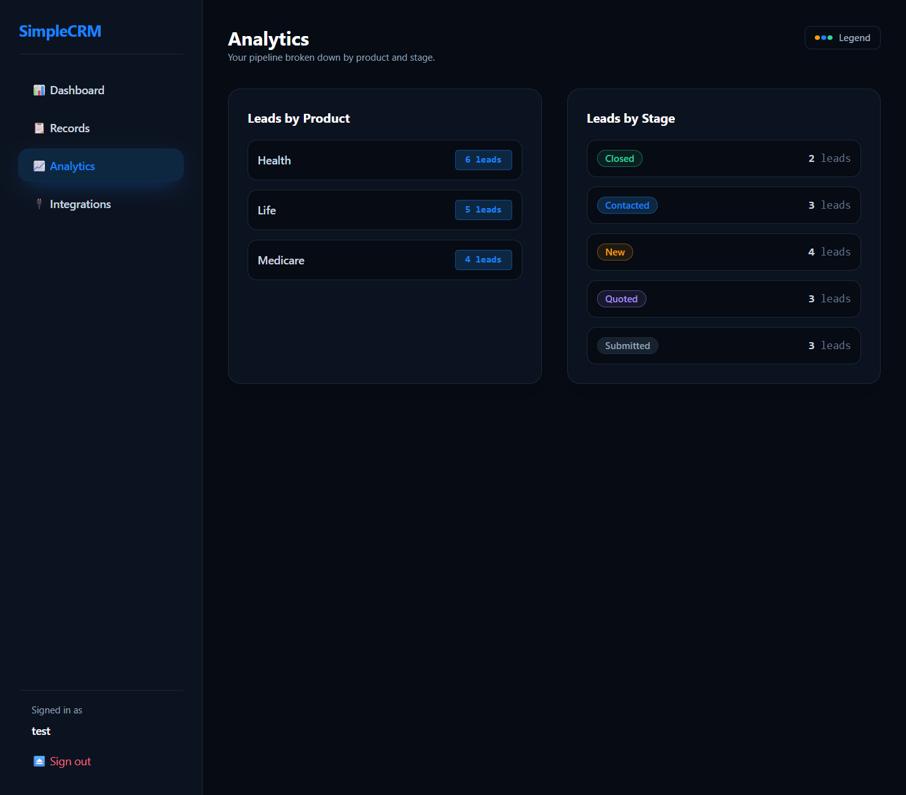
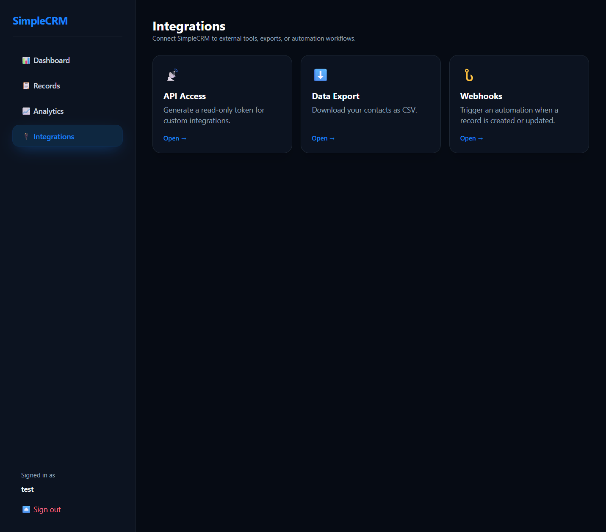
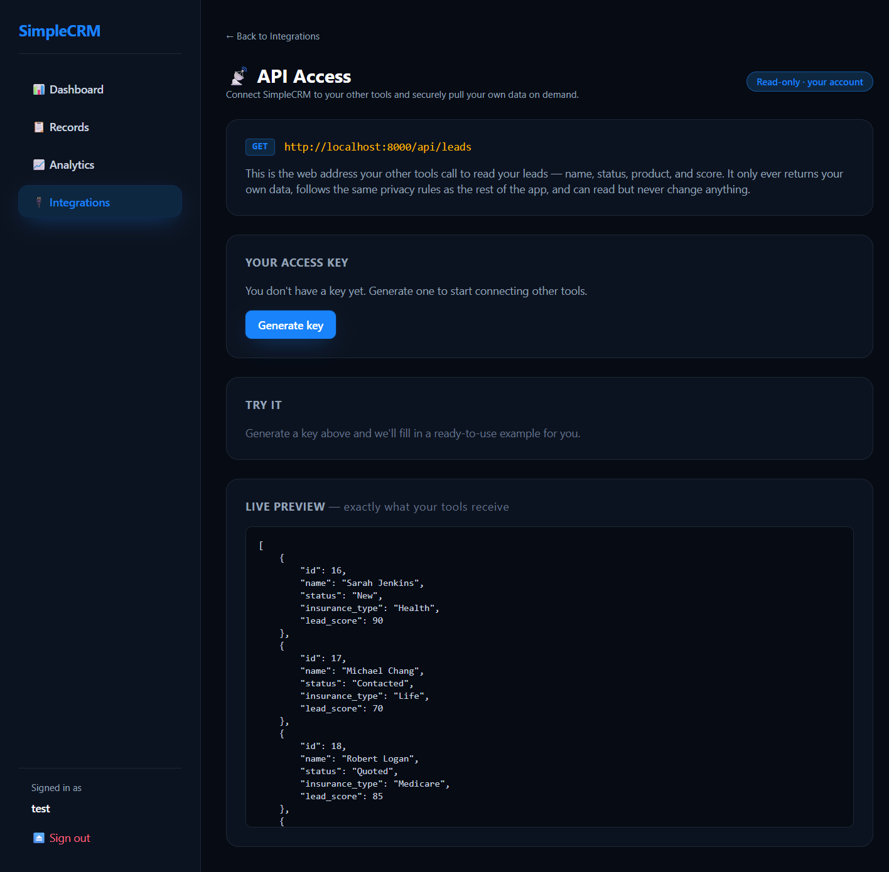
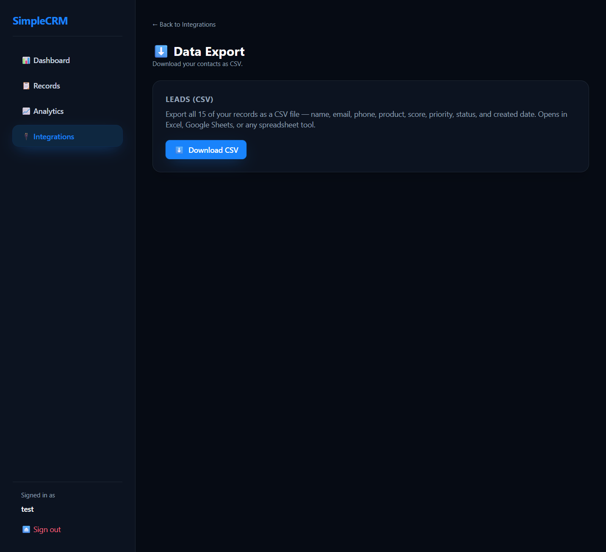
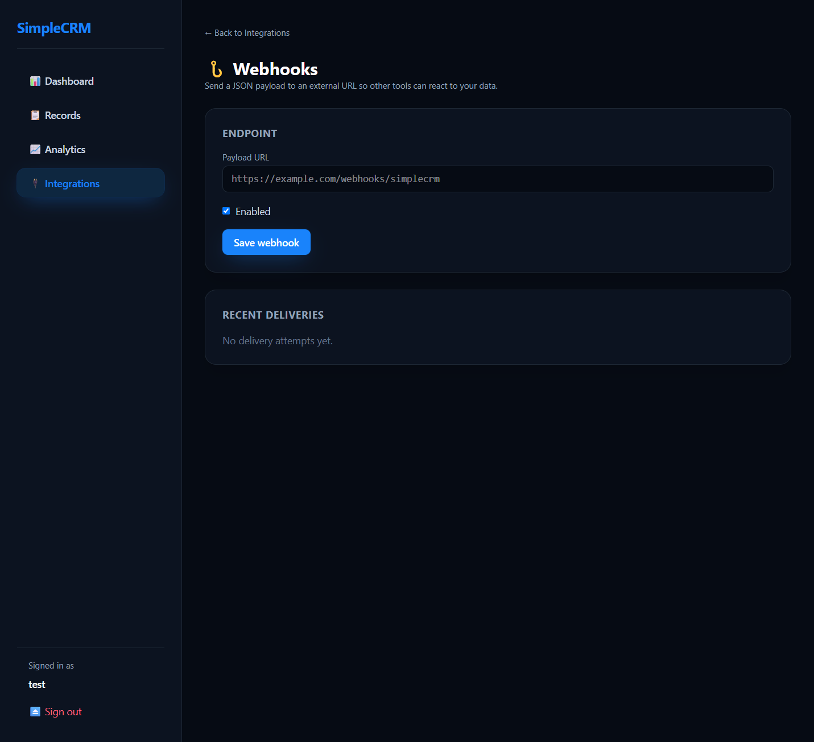

# SimpleCRM

A lightweight, multi-tenant CRM for insurance lead management — built to showcase a clean server-rendered Laravel architecture with an automated lead-scoring engine, per-user data isolation, and a tested codebase.

[](https://github.com/cody-sims-git-hub/simple-crm/actions/workflows/ci-cd.yml)
&nbsp;_runs:_


**Live demo:** **[demo.simsdigitalpartners.com](https://demo.simsdigitalpartners.com)** — sign in with the read-only demo account `demo@example.com` / `password`, or register your own.

---

## Overview

SimpleCRM models the day-to-day workflow of an insurance sales desk: leads come in, get **automatically scored and prioritized**, move through a defined pipeline (New → Contacted → Quoted → Submitted → Closed), and roll up into dashboard metrics and analytical reports. Every account is fully isolated — agents only ever see their own book of business.

It's intentionally small in surface area but deliberate in its engineering: the interesting parts are the **scoring automation** and the **ownership model**, both implemented so they apply everywhere with almost no repeated code.

## Screenshots

### Dashboard
Live pipeline metrics, the add-a-lead form, and the auto-prioritized high-priority queue.



### Records
Your full book of business — each lead's score, priority, and pipeline stage at a glance, with inline editing and one-click status changes.



### Analytics
SQL `GROUP BY` aggregations by product line and pipeline stage.



### Integrations
Connect SimpleCRM to external tools — token API access, CSV export, and webhooks.



#### API access
Generate a Sanctum Bearer token, copy a ready-to-run `curl`, and see the live JSON response, scoped to your account.



#### Data export
Download your leads as a CSV.



#### Webhooks
Save an endpoint, send a test delivery, and review the delivery log — with an SSRF-guarded URL check.



## Tech Stack

| Layer | Technology |
|-------|-----------|
| Language | PHP 8.4 |
| Framework | Laravel 13 |
| Database | SQLite (zero-config; swappable for MySQL/Postgres) |
| ORM | Eloquent (global scopes, model events, relationships) |
| Views | Blade (server-side rendering) |
| Styling | Tailwind CSS v4 |
| Build tooling | Vite + `laravel-vite-plugin` |
| Auth | Session-based, hand-rolled (no starter kit) |
| API auth | Laravel Sanctum (Bearer tokens) |
| Testing | PHPUnit 12 |
| Code style | Laravel Pint |

## Key Features

- **Automated lead scoring & prioritization** — inbound leads are triaged on creation (see below).
- **Per-user data ownership (multi-tenancy)** — enforced globally via a single Eloquent scope.
- **Read-only demo mode** — the shared `demo@example.com` account can browse everything but can't mutate data (blocked server-side by middleware, with the controls hidden in the UI); every registered user keeps full CRUD.
- **Full lead lifecycle** — create, view, edit, delete, and a one-click status workflow.
- **Dashboard** — live pipeline counts and a "high-priority queue" of the top leads to work.
- **Reporting** — SQL `GROUP BY` aggregations by product line and pipeline stage.
- **Token API** — `GET /api/leads` returns the authenticated user's leads as JSON, authenticated by a Sanctum Bearer token and scoped to that user. Manage your token on the in-app **Integrations → API access** page.
- **Auto-seeded demo data** — every new account is provisioned with a realistic starter pipeline.
- **Validated inputs** — insurance type is whitelisted; the UI and data never drift apart.

## The Lead Scoring & Prioritization Engine

When a lead is created or updated, `LeadController` runs a deterministic scoring pass that mimics how a sales team triages inbound interest — favoring **contactability** and **product value**.

**Score** starts at a baseline of `50` and is adjusted by signal:

| Signal | Adjustment | Rationale |
|--------|-----------|-----------|
| Phone number present | **+20** | A reachable lead is far more likely to convert |
| Insurance type = Health | **+20** | Highest-value / highest-intent product line |
| Insurance type = Medicare | **+15** | High-value, time-sensitive enrollment window |
| Insurance type = Life | +0 | Longer sales cycle, lower immediate intent |

This yields a score from **50 to 90**, which is then mapped to a **priority** tier:

| Score | Priority |
|-------|----------|
| ≥ 80 | **High** |
| 60–79 | **Medium** |
| < 60 | **Low** |

So a Health lead with a phone number scores `50 + 20 + 20 = 90 → High` and surfaces at the top of the dashboard's high-priority queue, while a Life lead with no phone scores `50 → Low`. Reps always know what to work next without manual sorting.

> The scoring rules live in one place and are re-applied on every create and update, so a lead's priority always reflects its current data.

## Architecture Highlights

**Multi-tenancy via a single global scope.** Rather than sprinkling `where('user_id', ...)` across every query, ownership is enforced once on the `Lead` model:

- A **global scope** filters every query to the authenticated user — covering the dashboard, pipeline list, reporting aggregations, the JSON API, *and* route-model binding. Requesting another user's lead by ID returns a clean **404**, never leaked data.
- A **`creating` model event** automatically stamps `user_id`, so controllers never have to.

The result: the controller contains zero ownership-handling code, yet isolation is airtight.

**Single source of truth for demo data.** A `DemoData` provisioner holds the starter pipeline and is shared by both the registration flow and the database seeder, so new accounts and fresh installs stay in sync.

**Tested where it matters.** The suite covers the guarantees that are easy to get wrong: ownership stamping, cross-user access returning 404, API scoping, validation rejection of unsupported types, and per-account demo provisioning.

## Getting Started

**Requirements:** PHP 8.4+, Composer, and Node.js 22+ (Tailwind is compiled through Vite, so the front-end assets are built locally).

```bash
# Install dependencies, create .env, generate key, migrate + seed, build assets
composer run setup

# Start the app (serve + queue + logs + Vite, all at once)
composer run dev
```

Then open the app and sign in with the seeded demo account, or register a new one (new accounts come pre-loaded with their own demo pipeline):

```
Email:    demo@example.com
Password: password
```

> Prefer the bare minimum? `composer run setup` builds the front-end assets, after which `php artisan serve` will serve them. Tailwind is compiled through Vite (not a CDN), so the assets must be built — run `composer run dev` during development to recompile on change.

## Testing

```bash
php artisan test
```

## Project Structure

```
app/
  Http/Controllers/   LeadController (CRUD + scoring), AuthController
  Models/             Lead (global scope + scoring hook), User
  Support/            DemoData (shared starter-pipeline provisioner)
database/
  migrations/         leads, users, + user_id ownership column
  seeders/            DatabaseSeeder (demo account + pipeline)
  factories/          LeadFactory, UserFactory
resources/views/      Blade: dashboard, leads, reporting, auth, layout
routes/web.php        Guest auth routes + auth-protected CRM routes
tests/Feature/        Ownership, scoping, validation, provisioning
```

## API

`GET /api/leads` — returns the authenticated user's leads as JSON (id, name, status, insurance_type, lead_score).

Authenticated with a [Laravel Sanctum](https://laravel.com/docs/sanctum) personal access token. Generate yours on the in-app **Integrations → API access** page, then:

```bash
curl -H "Authorization: Bearer <your-token>" https://demo.simsdigitalpartners.com/api/leads
```

Results are scoped to the token owner by the relationship query in `LeadApiController` (the model's global owner scope keys off the web session and is intentionally bypassed for stateless token requests). The read-only demo account exposes a fixed token directly on its API access page (under Integrations) so visitors can try it.

---

*Built as a portfolio project to demonstrate practical Laravel architecture — Eloquent global scopes, model-event automation, validation, seeding/factories, and a focused test suite.*
